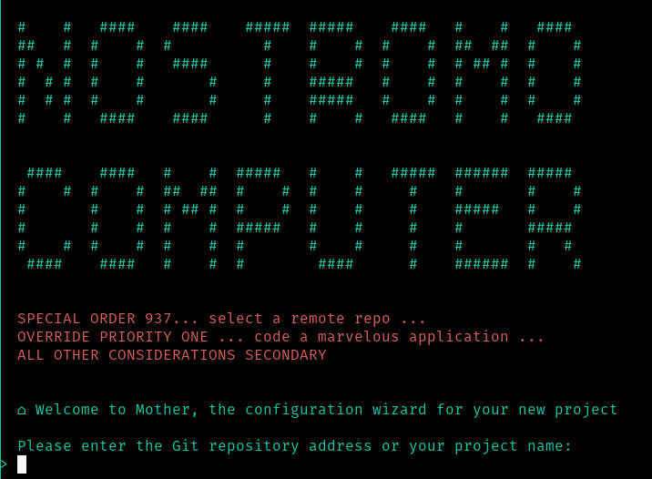

# 📦 React Modele Vite

## Description

Welcome to Nostromo, a CLI allowing you to create a React template to a remote repo.
It builds the template to your local folder and make the first commit,
then open the repo with VSCode.

## Overview



## TOOLS

 - react
 - react-dom
 - typeScript
 - vite
 - eslint-airbnb

## Use

It's basically a copying/pasting the interesting parts
of the model in the project folder, without overwriting any specific files.

To create a modele template :

- go to the folder which will contain your new project

  > the repo `React-modele-vite` **must** also be there.

- run the wizard to get the remote repository :

      ```sh
      cd dossier/my_repo
      # Example : ../../../my_personnal_repo

      # launch script
      ./React-modele-vite/bin/install.sh
      # if necessary, give rights to this file :
      # `sudo chmod +x ./React-modele-vite/bin/install.sh`

      # Give :
      #   - new project name
      #   - Git repo SSH address (ex : git@github.com:random-project.git)
      ```

## Additional tools reminder

- COMBO 1 : react-redux + @reduxjs/toolkit

```
npm i react-redux @reduxjs/toolkit
```
or
```
yarn add react-redux @reduxjs/toolkit
```

- COMBO 2 : recoil

```
npm i recoil
```
or
```
yarn add recoil
```